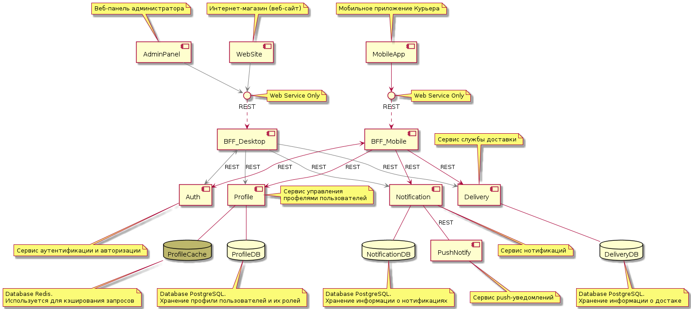

# Catalog service

## Содержание
1. [Описание проекта](#описание)
2. [Архитектура проекта](#архитектура-проекта)
3. [Используемые технологии](#используемые-технологии)
4. [Структура проекта](#структура-проекта)
5. [Работа с проектом](#работа-с-проектом)  
5.1 [Настройка виртуального окружения](#настройка-виртуального-окружения)    
5.2 [Переменные окружения](#переменные-окружения)  
5.3 [Управление миграциями через Alembic](#управление-миграциями-через-Alembic)  
5.4 [Запуск проекта](#запуск-проекта)  
    * [Этапы запуска](#этапы-запуска)  
6. [Полезные материалы](#полезные-материалы)


## Описание 
### Компонент службы доставки по городу
Компонент предоставляет API для связи с другими компонентами:  
  * Принимает и сохраняет зоны в виде набора координат
  * Принимает данные Курьеров с привязкой к зоне доставки
  * Принимает координаты места доставки и возвращает данные Курьера и идентификатор зоны доставки

### Архитектура проекта

* [Диаграмма компонентов](architecture/out/Delivery.png)

## Используемые технологии
* Код приложения пишется на **Python + FastAPI**. 
* Приложение запускается под управлением сервера **ASGI**(uvicorn). 
* Хранилище – **PostgreSQL**. 
* За кеширование данных отвечает – **redis cluster**. 

## Структура проекта
* Корень проекта — в нём находятся базовые вещи, например, ci и gitignore.
* `architecture` — архитектура приложения.
* `src` — содержит исходный код приложения.
* `main.py` — входная точка приложения.
* `api` — модуль, в котором реализуется API. Другими словами, 
  это модуль для предоставления http-интерфейса клиентским приложениям. 
  Внутри модуля отсутствует какая-либо бизнес-логика, так как она не должна быть завязана на HTTP.
* `core` — содержит разные конфигурационные файлы.
* `db` — предоставляет объекты баз данных (Redis, PostgreSQL) и провайдеры для внедрения зависимостей. 
  Redis будет использоваться для кеширования, чтобы не нагружать лишний раз PostgreSQL.
* `models` — содержит классы, описывающие бизнес-сущности
* `schemas` - содержит модели отвечающие за валидацию тела запроса.
* `services` — главное в сервисе. В этом модуле находится реализация всей бизнес-логики. 
  Таким образом она отделена от транспорта. Благодаря такому разделению,  будет легче добавлять новые типы транспортов в сервис. 

## Работа с проектом

### Настройка виртуального окружения
Необходима установка `pipenv`:
```bash
 $ pip install pipenv
```
В корневой директории запустить команду:  
```bash
$ pipenv install --ignore-pipfile
```

### Переменные окружения
```dotenv
DATABASE_DSN='<строка подключения к Database>'
```

### Управление миграциями через Alembic

**Данные операции необходимо выполнять из директории `src`**

1. Создание миграций:
   ```bash
   $  alembic -c ./models/alembic.ini revision -m "some message" --autogenerate
   ```
   Данная команда сгенерирует новую миграцию, но не применит её к БД.
   
2. Применение миграции к БД:
   ```bash
   $ alembic -c ./models/alembic.ini upgrade head
   ```

### Запуск проекта
1. Создать файл `.env`  
2. Запуск сервисов `PostgreSQL`, `Redis`  
    ```bash
    $ sudo docker-compose up -d
    ```  
3. После того как запустится `PostgreSQL`, `Redis`:  
    В корневой директории запустить:  
    ```bash
    $ ./entrypoint.sh
    ```

## Полезные материалы

[Пишем и тестируем миграции БД с Alembic](https://habr.com/ru/company/yandex/blog/511892/)  
[Pipenv: руководство по инструменту](https://webdevblog.ru/pipenv-rukovodstvo-po-novomu-instrumentu-python/)
